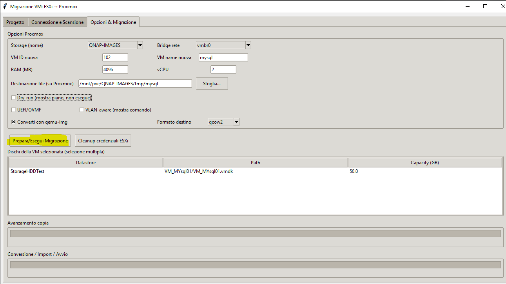

VM Migration: ESXi → Proxmox

Overview

- Desktop tool to migrate VMs from VMware ESXi to Proxmox VE.
- Copies VMDK from ESXi, converts with `qemu-img`, imports to target storage, and configures VM (including optional UEFI/OVMF).
- Progress bars and a dedicated progress log file for visibility.

Key Features

- ESXi copy via SCP with `sshpass` using a password file on Proxmox (no plaintext in commands).
- Conversion and import to Proxmox storage (`images`, `dir`, etc.).
- Optional UEFI/OVMF config (`q35`, `ovmf`, `efidisk0` with pre-enrolled keys).
- UI flow: Connect & Scan → Options & Migration.

Requirements

- Python 3.9+
- Proxmox VE reachable via SSH.
- ESXi host reachable via SSH (user with read access to datastore).

Quick Start

- Install deps: `pip install -r vm-migration-tool/requirements.txt`
- Run app: `python vm-migration-tool/main.py`
- In the UI:
  - Enter Proxmox and ESXi credentials.
  - Scan ESXi and choose a VM.
  - Pick Proxmox storage and options (UEFI/OVMF if original VM uses UEFI).
  - Start migration and monitor progress.

Security & Logging

- Password sanitization in application logs; sensitive values are redacted.
- ESXi password is written to `/root/esxi_pass.txt` on Proxmox (restricted permissions) and used via `sshpass -f`.
- Progress entries are also written to `vm-migration-tool/logs/progress-*.log`.
- Project files exclude secrets by design.

Usage Notes

- Enable UEFI/OVMF only if the original VM uses UEFI/EFI firmware; keep BIOS legacy otherwise.
- After a migration completes, you can select another VM and repeat without restarting the app.

Roadmap

- See [ROADMAP.en.md](ROADMAP.en.md) for planned features (multi-VM concurrent migration, improved transfer resilience, CI, and more).

Operational Instructions (Options & Migration)

- Uncheck `Dry-run (show plan, do not execute)` to actually run the migration.
- Check `Convert with qemu-img` to convert VMDK to the target format (default: `qcow2`).
- Select a Proxmox storage that supports `images` content (in Proxmox: Datacenter → Storage → your storage should include "Disk image").
  - If the storage does NOT support `images`, the app will warn and block the import.
- Field `Destination file (on Proxmox)`:
  - If the storage is mounted under `/mnt/pve/<storage>`, the suggested path is `/mnt/pve/<storage>/tmp/<vmName>`.
  - For non-mounted storages (e.g., `local-lvm`), the fallback is `/root/tmp/<vmName>`.
  - Use `Browse…` to set a custom path if needed.
- UEFI/OVMF: enable only if the original VM uses UEFI/EFI firmware; keep disabled for legacy BIOS.
- Press `Prepare/Run Migration` and follow the progress bars (copy and import/conversion).

Screenshot (example)

