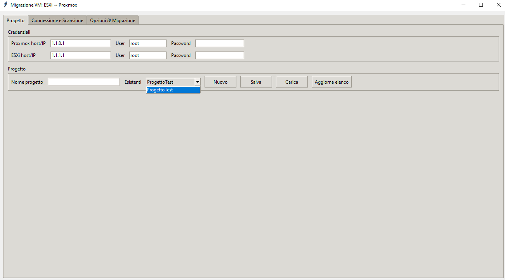
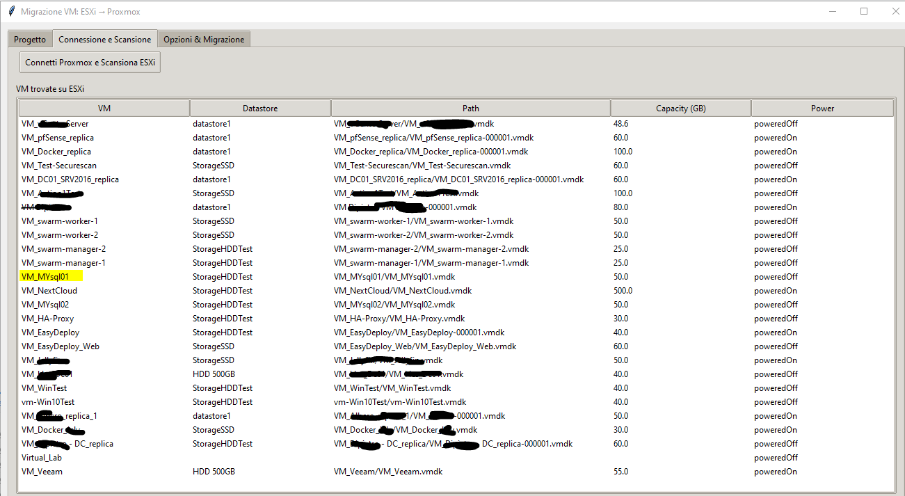

# 🧩 ProxMox VM Migration Tool  
_Migrate your virtual machines seamlessly from VMware ESXi to Proxmox VE_

[](https://github.com/DatacorpCloud/ProxMox-VM-Migration-Tool)
[](LICENSE)
[]()
[]()

---

## 🚀 Overview

**ProxMox VM Migration Tool** is a desktop utility to migrate virtual machines from **VMware ESXi** to **Proxmox VE**.  
It copies VMDK disks from ESXi, converts them using `qemu-img`, and imports them to target storage with automatic VM configuration — including optional UEFI/OVMF setup.

### ✨ Key Features
- Secure SCP transfer from ESXi via `sshpass` (password file, no plaintext).
- Conversion and import into any Proxmox storage (`images`, `dir`, etc.).
- Optional **UEFI/OVMF** configuration (`q35`, `efidisk0` with pre-enrolled keys).
- UI workflow: **Connect & Scan → Options → Migration**.
- Progress bars + detailed log file for transparency.

---

## ⚙️ Requirements
- Python **3.9+**
- Proxmox VE reachable via SSH
- ESXi host reachable via SSH (user with read access to datastore)

---

## 🧭 Quick Start

```bash
# Install dependencies
pip install -r vm-migration-tool/requirements.txt

# Run the application
python vm-migration-tool/main.py
```
---

## 📸 Screenshots

1. **Create Project**  
   

2. **Connection & Scan**  
   

3. **Options & Migration**  
   

---


## 🖥️ In the UI

1. **Enter** Proxmox and ESXi credentials.  
2. **Scan** ESXi and select a VM.  
3. **Pick** Proxmox storage and options (UEFI/OVMF if applicable).  
4. **Start migration** and monitor progress.

---

## 🔐 Security & Logging

- Sensitive credentials are **redacted** from logs.  
- The ESXi password is stored at `/root/esxi_pass.txt` on Proxmox (with secure permissions).  
- Migration progress logs are written under  
  `vm-migration-tool/logs/progress-*.log`.  
- Project files are designed to **exclude secrets by default**.

---

## 🧩 Usage Notes

- Enable **UEFI/OVMF** only if the source VM uses UEFI firmware; keep **legacy BIOS** otherwise.  
- After a migration completes, you can start another one **without restarting the app**.  
- Ensure the selected Proxmox storage supports **Disk image** content type  
  (`Datacenter → Storage → check “Content: Disk image”`).

---

## 🗺️ Roadmap

See [`ROADMAP.en.md`](ROADMAP.en.md)

---

