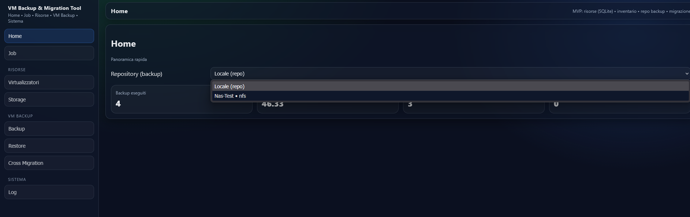
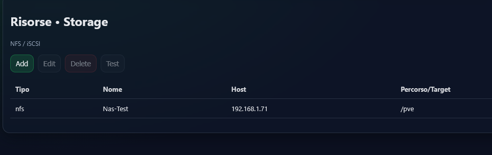
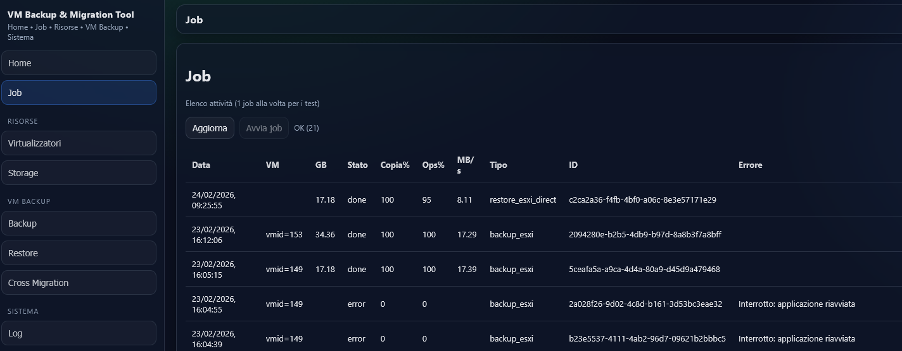
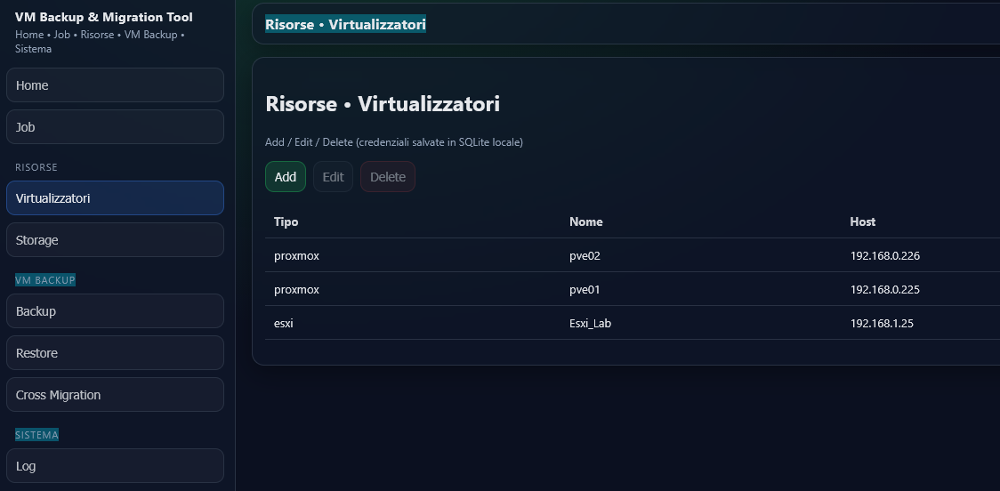
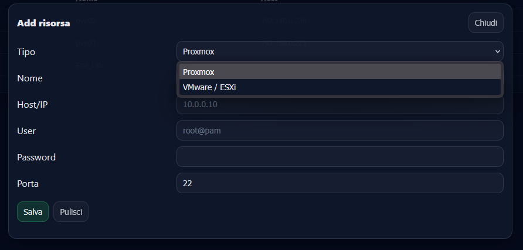
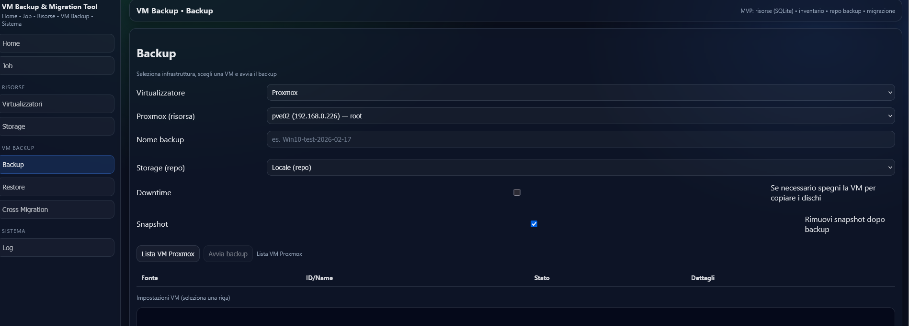
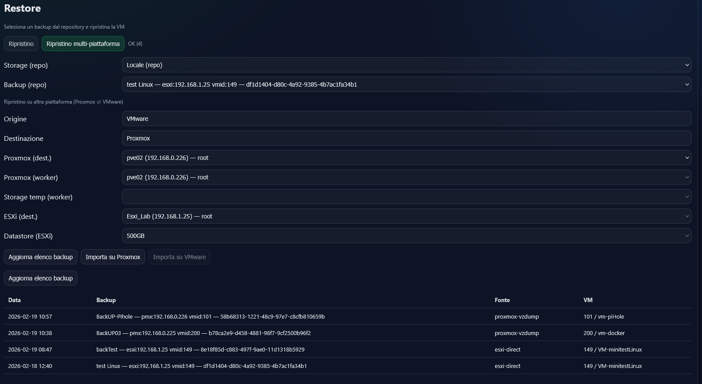
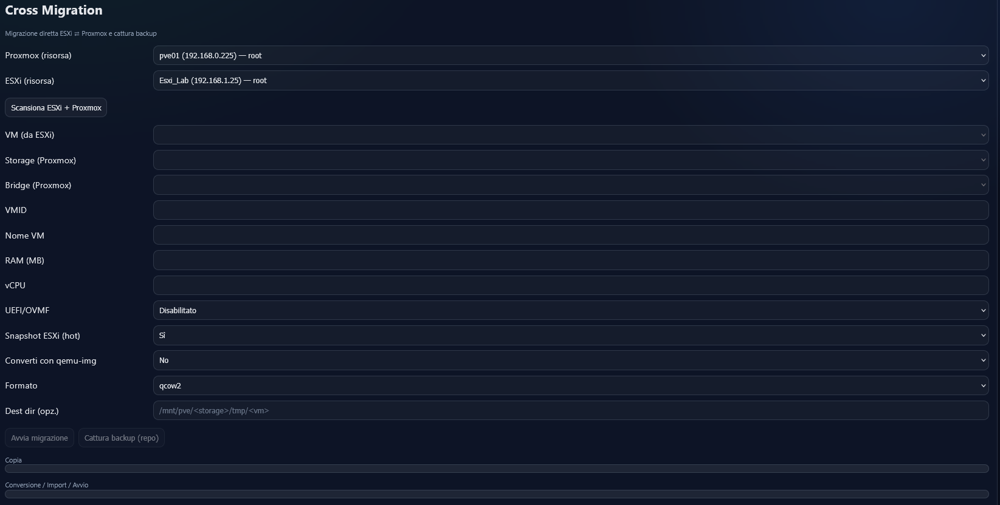

Documentazione e screenshot

- Le guide utente sono in `README.it.md` e `README.en.md`.
- Gli screenshot citati nei README vanno inseriti in `docs/screenshots/`.
- Convenzione nomi:
  - `options_migration.png` — schermata "Opzioni & Migrazione" con evidenza su Dry-run e qemu-img.
  - `scan_list.png` — schermata "Connessione e Scansione" con elenco VM.

Suggerimenti per gli screenshot

- Dimensione consigliata: circa 1280×720 per leggibilità.
- Offuscare eventuali dati sensibili (IP, nomi macchina) prima di pubblicare.

Screenshot Web UI 

1. Home
   
2. Risorse • Storage
   
3. Job
   
4. Risorse • Virtualizzatori (elenco)
   
5. Risorse • Virtualizzatori (Add virtualizzatore)
   
6. Backup
   
7. Restore multi‑piattaforma
   
8. Live Cross Migration
   
